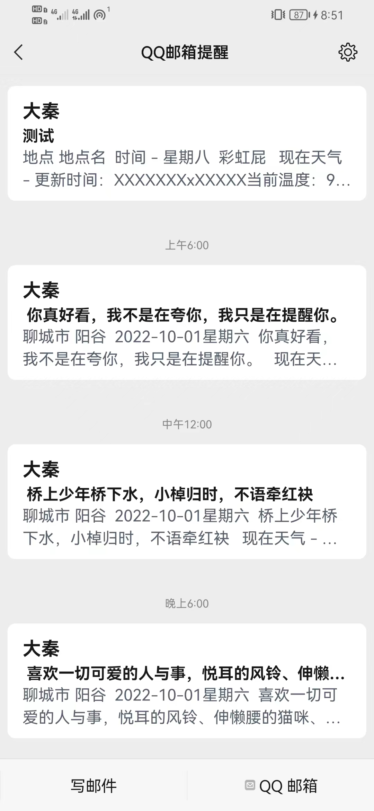
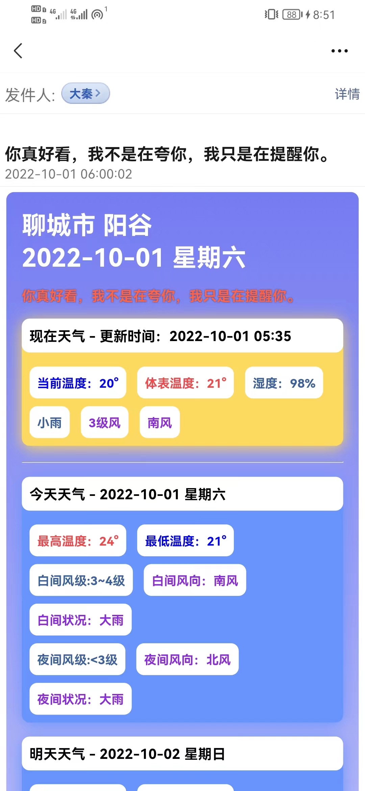
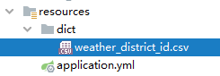
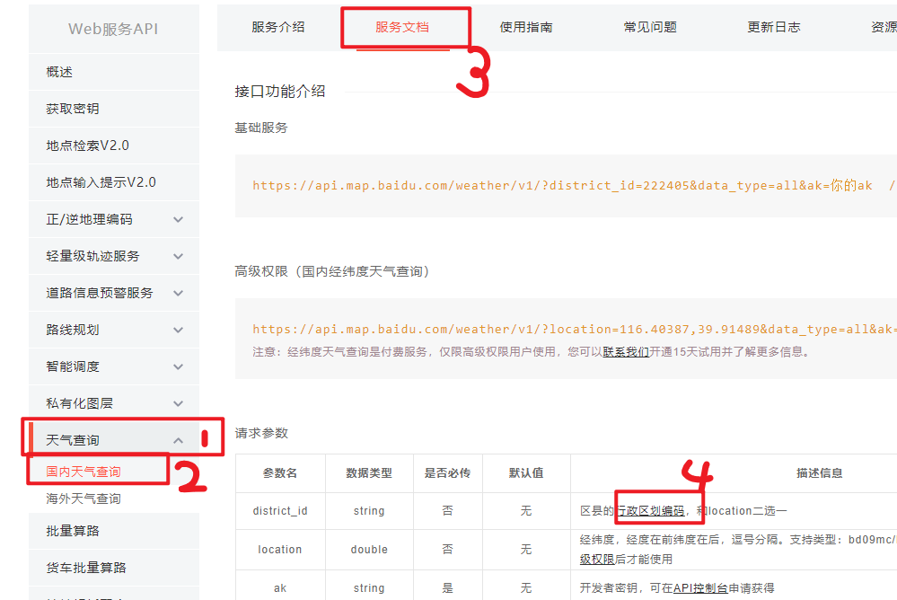
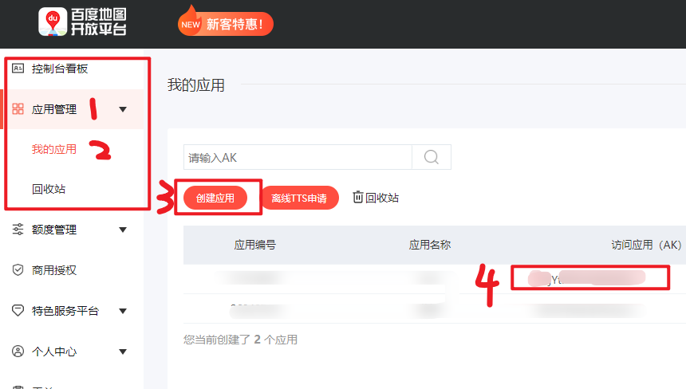

# wechatMsg

#### 介绍
微信邮箱天气信息推送（SpringBoot - Java）

#### 软件架构
可以通过绑定QQ邮箱来提示每天的天气状况

#### 安装教程

#### 使用说明

##### 如何获取城市

1. **district_id** 找到resourses目录下的csv文档查找相关地址即可

> 最新版本可去百度地图APK
> https://lbs.baidu.com/index.php?title=webapi/weather

2.**应用AK**

登录百度地图开放平台，创建应用后即可获得

3. *rainbowKey*

注册登录天行数据，每日免费100次彩虹屁接口
> https://www.tianapi.com/apiview/181

4.**username**
邮箱

5.**password**
授权码

